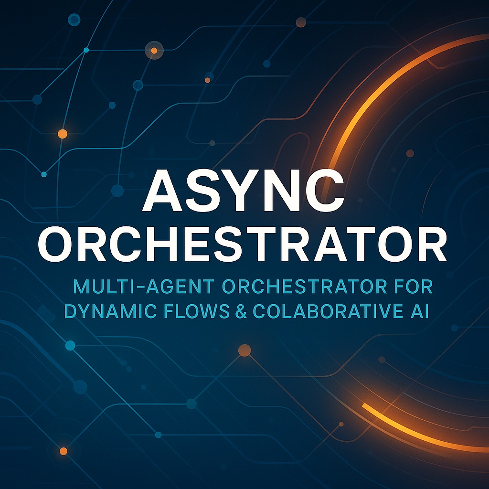

banner.jpg

# Async Orchestrator

A resilient, multi-agent orchestration engine enabling collaborative AI-driven solutions across diverse domains. Built on asynchronous execution, circuit breakers, fallback logic, and instrumentation, this system routes queries to specialized roles (Proposer, Critic, Synthesizer, Implementer, Validator, Observer) powered by OpenAI and Anthropic models under epistemic democracy principles.

## Key Features

- **Multi-Role Collaboration**: Define and execute distinct agent roles with clear responsibilities using `CollaborativePromptLibrary`.
- **Asynchronous Execution**: Leverages `asyncio` and `aiohttp` for non-blocking LLM API integration.
- **Circuit Breakers & Fallbacks**: Automatic isolation of failing roles and tiered fallback to cache or simpler models.
- **Complexity-Driven Triage**: Dynamically routes to Express or Council modes based on query complexity metrics.
- **Comprehensive Instrumentation**: Real-time monitoring and historical performance tracking via `OrchestrationInstrumentation`.

## Architecture Overview

```
+-----------------+        +---------------------+        +------------------+
|  Triage Agent   |------->| Async Orchestrator  |------->| LLM Providers    |
| (Complexity +   |        |                     |        | (OpenAI, Claude) |
|  Mode Selection)|        | - Circuit Breakers  |        +------------------+
+-----------------+        | - Fallback Logic    |
                           | - Prompt Routing    |
                           | - Instrumentation   |
                           +---------------------+
```

## Prerequisites

- Python 3.10+
- `pip install -r requirements.txt`
- Valid API keys for:
  - OpenAI (ENV: `OPENAI_API_KEY`)
  - Anthropic (ENV: `ANTHROPIC_API_KEY`)

## Installation

```bash
git clone https://github.com/yourorg/async-orchestrator.git
cd async-orchestrator
pip install -r requirements.txt
```

## Configuration

Create a `.env` file or export environment variables:

```bash
export OPENAI_API_KEY="sk-..."
export ANTHROPIC_API_KEY="sk-ant-..."
```

## Usage

```python
import asyncio
from orchestrator import AsyncOrchestrator, RoleDefinition, TriageRequest

roles = [
    RoleDefinition("proposer", timeout_seconds=10),
    RoleDefinition("critic", timeout_seconds=8),
    RoleDefinition("synthesizer", timeout_seconds=12),
    RoleDefinition("implementer", timeout_seconds=15),
    RoleDefinition("validator", timeout_seconds=8),
    RoleDefinition("observer", timeout_seconds=5)
]

orchestrator = AsyncOrchestrator(roles, openai_key="$OPENAI_API_KEY", anth_key="$ANTHROPIC_API_KEY")

async def run():
    request = TriageRequest(query="Design a scalable microservice architecture for customer analytics.")
    result = await orchestrator.process_request(request)
    print(result['decision'])
    print(result['aggregated'])

asyncio.run(run())
```

## Project Structure

```
async_orchestrator/
│
├── orchestrator.py         # Core AsyncOrchestrator implementation
├── collaborative_prompt_library.py   # Defines agent roles & prompts
├── orchestration_instrumentation.py   # Metrics & monitoring
├── requirements.txt         # Dependencies
├── README.md                # Project overview
└── tests/                   # Integration & unit tests
```

## Contributing

1. Fork the repository
2. Create a feature branch: `git checkout -b feature/my-feature`
3. Commit changes: `git commit -m "Add my feature"`
4. Push: `git push origin feature/my-feature`
5. Open a Pull Request

Please follow our [Code of Conduct](CODE_OF_CONDUCT.md) and review guidelines.

## License

This project is licensed under the [MIT License](LICENSE).

---

*Built with ❤️ for federated, transparent, and democratic AI collaboration.*

